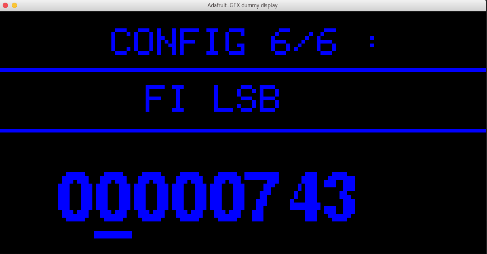

Adafruit-GFX-dummy-display aims to provide a virtual display to develop graphics using Adafruit-GFX-Library (https://github.com/adafruit/Adafruit-GFX-Library) without hardware.

It is currently using SDL graphic library and runs under Linux.
Under Debian it is installed using the following command
```
sudo apt install libsdl2-dev
```

HOW TO :

* Clone this project
```
git clone --recursive https://github.com/croutor/Adafruit_GFX_dummy_display.git
```

* Patch Adafruit-GFX-Library/Adafruit_GFX.h to add on line 3:
#define ARDUINO 123

* Compile the dummy display example:
```
make
```
* Run the program
```
./dummy-display-example
```

You should see something like this:



* Stop the program using Alt+F4


It is not an Adafruit project. But I want to say thank you to Adafruit for all the fun I have using Arduino!

Author: Vincent Hervieux


